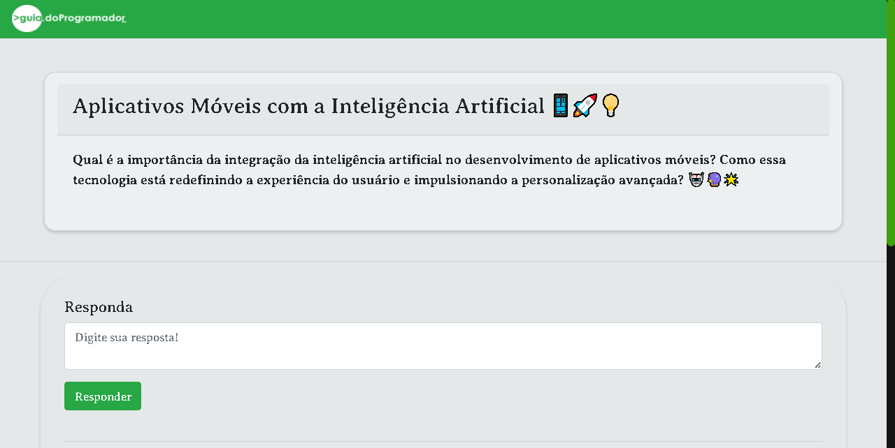

<h1 align="center">Perguntas & Respostas</h1>

 
  

## 📖 Descrição

Este projeto acadêmico, iniciado em 01/08/23, marcou o início dos meus estudos nas tecnologias do back-end, como Node.js e MongoDB. Ele faz parte do curso "Quia do Programador" e tem um foco central nas habilidades de back-end. Durante o desenvolvimento, utilizei as seguintes tecnologias: 
  
  
  
  
  . O projeto visa propocionar uma plataforma de perguntas e respostas anonimas onde os dados são salvos em um bando de dados MongoDB.
  

## 🚀 Como Usar

Para começar a usar o projeto, siga estas etapas simples. todo mundo conseque fica com preguiça não kkkk:

1. Faça o download deste projeto clicando no botão verde "Code" nesta página e selecionando "Download ZIP".
2. Extraia o arquivo ZIP em uma pasta no seu computador.
3. Navegue até o diretório onde você extraiu os arquivos `cd "procure pela pasta que foi baixado provavelmente em 'Download'"`.
4. Abra o arquivo `[My-personal-project-main]` em um editor de texto como o Visual Studio Code ou parecido 
5. Agora você pode explorar o código, fazer modificações ou executar o projeto de acordo com a documentação.
6. Certifique-se de atender a quaisquer [requisitos de software ou dependências] necessários antes de prosseguir. para isso basta rodar o comando dentro do terminal do editor de texto `npm install`
7. caso queira ver o site em rodando execute no terminal o comando `npm run dev`

## 🤝 Contribuição

Eu adoraría receber contribuições da sua parte!

## 📞 Contato

Se você tiver alguma dúvida ou quiser entrar em contato, sinta-se à vontade para me encontrar em ramon.rodrigues.dev@gmail.com.
Agradeço muito pelo seu interesse no Livre Leitor!

